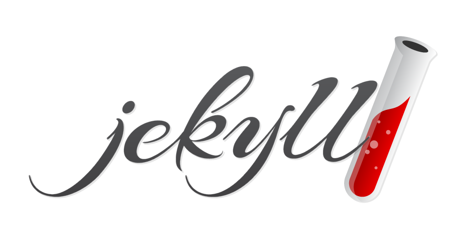

# Jekyll

基於 Ruby 程式語言與 Liquid 模板語言的靜態網站產生器

<https://gitlab.com/libre-knowledge/jekyll>  
   

## 官方資源

以下列舉本主題相關的官方資源：

* [Jekyll’s logo](https://github.com/jekyll/brand)  
  Logo files for [Jekyll](http://jekyllrb.com).

## 參考資料

以下列舉撰寫本主題內容時所參考的第三方資源：

* [Jekyll • Simple, blog-aware, static sites | Transform your plain text into static websites and blogs](https://jekyllrb.com/)  
  官方網站
* [Quickstart | Jekyll • Simple, blog-aware, static sites](https://jekyllrb.com/docs/)  
  官方說明文件

---

本主題為[自由知識協作平台](https://gitlab.com/libre-knowledge/libre-knowledge)的一部分，除部份特別標註之經合理使用(fair use)原則使用的內容外允許公眾於授權範圍內自由使用

如有任何問題，歡迎於本主題的[議題追蹤系統](https://gitlab.com/libre-knowledge/jekyll/-/issues)創建新議題反饋
